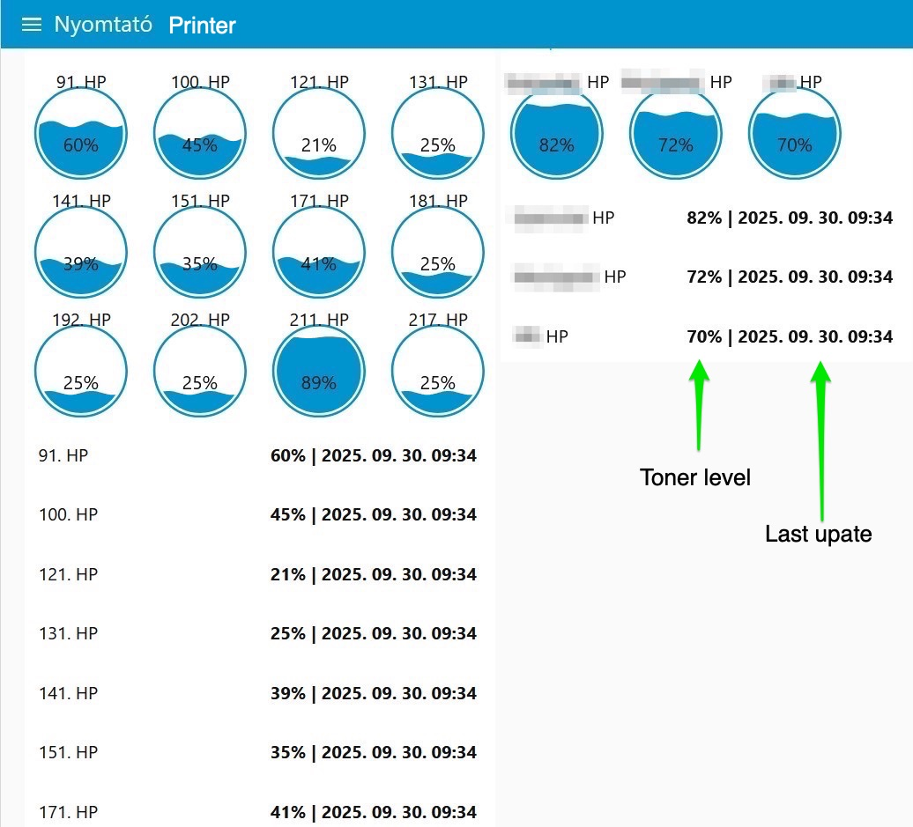

# node-red-snmp-printer-monitor
Centralized printer toner monitoring using Node-RED and SNMP on Raspberry Pi. / Nyomtatók toner szintjének központi monitorozása Node-RED + Raspberry Pi segítségével.

# Printer Toner Monitor

## English Version

This project provides a centralized solution for monitoring printer toner levels using **Node-RED**, **SNMP**, and a **Raspberry Pi**.  
The system periodically queries networked printers via SNMP protocol, collects toner level data at regular intervals, and visualizes the information on a Node-RED dashboard.

### ✨ Features
- Monitor multiple printers from a single Raspberry Pi
- Periodic data collection via SNMP (not real-time)
- Node-RED dashboard for easy visualization
- Easy to extend for additional printer metrics (page count, status, etc.)

### 🛠️ Technologies
- **Raspberry Pi** as central hardware
- **Node-RED** for data processing and visualization
- **SNMP** protocol for printer communication

### 🖼️ Dashboard

### ⚙️ Node-RED Flow

## 🇭🇺 Magyar verzió

Ez a projekt központi megoldást kínál a nyomtatók toner szintjének monitorozására **Node-RED**, **SNMP** és **Raspberry Pi** segítségével.  
A rendszer időközönként lekérdezi a hálózatban lévő nyomtatókat SNMP protokollon keresztül, összegyűjti a toner szinteket, és a Node-RED dashboardon jeleníti meg az adatokat.

### ✨ Főbb jellemzők
- Több nyomtató monitorozása egy Raspberry Pi-ről
- Időközönkénti adatgyűjtés SNMP-n keresztül (nem valós idejű)
- Node-RED dashboard az adatok vizualizálására
- Könnyen bővíthető további nyomtató-mutatókra (pl. lapolvasás, státusz)

### 🛠️ Használt technológiák
- **Raspberry Pi** központi hardverként
- **Node-RED** az adatok feldolgozásához és vizualizálásához
- **SNMP** protokoll a nyomtatók lekérdezéséhez
